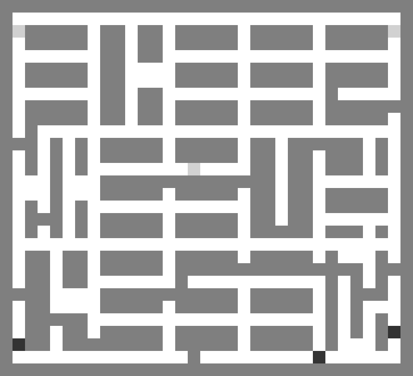

<div align="center">


## ORION: Option-Regularized Deep Reinforcement Learning for Cooperative Multi-Agent Online Navigation

🔹 **ORION** is an efficient RL planner for multi-agent navigation in partially known environments. 

🔹 **ORION** enables real-time, decentralized cooperation by coordinating individual target-reaching and team-level online uncertainty reduction via option-based networks and dual-stage navigation strategy.

🔹 ORION's paper can be found [here](https://arxiv.org/abs/2601.01155).

<video src="imgs/orion_ros.mp4" controls autoplay loop muted width="500"></video>

</div>


### Environment Setup

We use conda/mamba to manage the environment.

```bash
conda create -n orion python=3.10 -y
conda activate orion

pip install torch torchvision
pip install opencv-python scikit-image imageio pandas
pip install matplotlib tensorboard
pip install ray wandb
```
Clone this repository and navigate to the directory.
```bash
git clone https://github.com/marmotlab/ORION-multi-agent-navigation.git
cd ORION-multi-agent-navigation
```
### Datasets and Checkpoints
**Training datasets** are provided in:
- `maps_priori/`
- `maps_GT/`

**Evaluation datasets** are provided in:
- `maps_priori_test_new_{n}/`
- `maps_GT_test_new_{n}/`

where `{n}` denotes the number of agents in the team.

The training set consists of **simple maps with 3 agents only**.  
During evaluation, ORION scales to **larger teams (3, 4, 5, and 10 agents)** and **more complex environments** without additional training.

We also provide a pretrained checkpoint. As ORION is a **decentralized multi-agent navigation planner**, the same checkpoint can be directly applied to different team sizes.

<div align="center">
  
  
  <p>
    Examples of training (left) and evaluation (right) maps.
  </p>
</div>


### Training and Evaluation

For training, configure the parameters in `parameter.py`, then run:
```bash
python driver.py
```
For evaluation, configure the parameters in `test_parameter.py`, then run:
```bash
python test_driver.py
```
Inline comments are provided in both files to facilitate parameter configuration.

### Roadmap

- ✅ ORION paper released: https://arxiv.org/abs/2601.01155
- ✅ Training and evaluation code released
- ⏳ ROS-based implementation (coming soon)


### Credit

If you find this work helpful, please consider citing:

```bibtex
@article{shizhe2026orion,
  title={ORION: Option-Regularized Deep Reinforcement Learning for Cooperative Multi-Agent Online Navigation},
  author={Shizhe, Zhang and Jingsong, Liang and Zhitao, Zhou and Shuhan, Ye and Yizhuo, Wang and Derek, Tan Ming Siang and Jimmy, Chiun and Yuhong, Cao and Guillaume, Sartoretti},
  journal={arXiv preprint arXiv:2601.01155},
  year={2026}
}
```

ORION is inspired by following works, and we thank them for their contributions!

+ [Context-Aware Deep Reinforcement Learning for Autonomous Robotic Navigation in Unknown Area](https://proceedings.mlr.press/v229/liang23a.html), CoRL 2023
+ [The Option-Critic Architecture](https://dl.acm.org/doi/10.5555/3298483.3298491), AAAI 2017
+ [ARiADNE ROS Planner](https://github.com/marmotlab/ARiADNE-ROS-Planner)
+ [CMU Development environment](https://www.cmu-exploration.com/development-environment)
+ [Octomap](https://octomap.github.io/)

### Authors
[Shizhe Zhang*](),
[Jingsong Liang*](https://jingsongliang.com/),
[Zhitao Zhou](),
[Shuhan Ye](),
[Yizhuo Wang](https://yizhuo-wang.com/),
[Derek Ming Siang Tan](https://www.derektanmingsiang.com/),
[Jimmy Chiun](https://jimmychiun.me/),
[Yuhong Cao](https://www.yuhongcao.online/),
[Guillaume Sartoretti](https://marmotlab.org/bio.html)